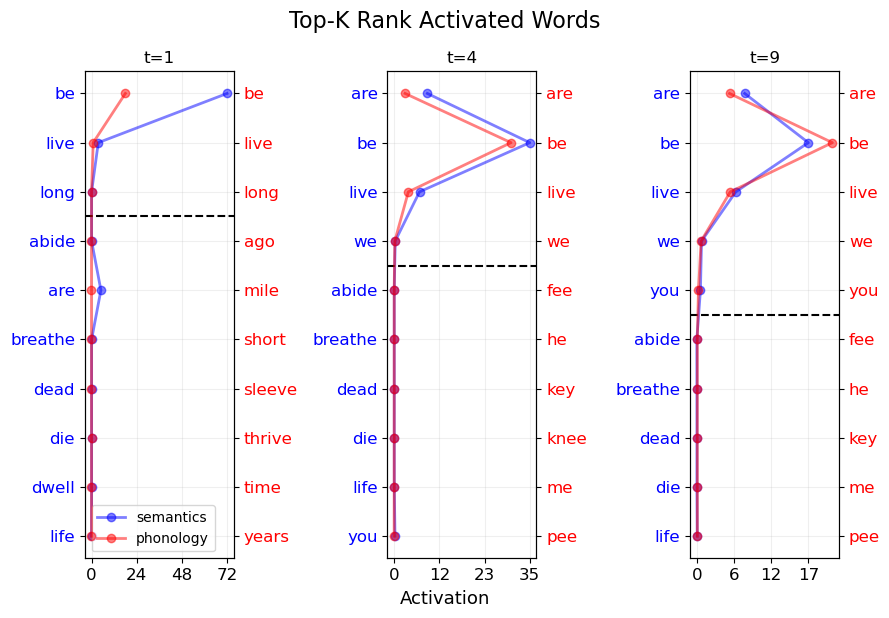

# SpreadPy: Semantic Processing Simulation in Python

``SpreadPy`` is a python package that simulates human semantic processing as *spreading activation* models on complex lexical networks. The package supports various network representations such as *node-enriched* and *multi-layer* networks.

The base spreading activation model, inspired by [Vitevitch et al. (2011)](https://www.frontiersin.org/articles/10.3389/fpsyg.2011.00369/full) and [Siew (2019)](https://link.springer.com/article/10.3758/s13428-018-1186-5), operates on a simple undirected graph. In this model, nodes distribute activation energy uniformly to their neighbors while retaining a portion for themselves.

Formally, at each timestamp $t$, for an active node $i$ with a non-zero activation value, energy "spreads" equally among $i$'s adjacent neighbors. The quantity spread from node $i$ to its neighbor $j$ is computed based on the node's activation value $e_{i,t}$, the retention factor $r$, and the degree of the node $deg(i)$ as follows:

$\varphi(i,j) = \frac{e_{i,t} \times (1-r)}{deg(i)}$.

When using *node-enriched networks*, the package incorporates information about similarity between words' attributes into edge weights. In this scenario, activation energy does not spread uniformly. The quantity spread from node $i$ to neighbor $j$ considers attributes' similarity and a normalization factor to regulate energy flow:

$\varphi(i,j) = e_{i,t} \times (1-r) \times \alpha_{i,j}$,

where $\alpha_{i,j}$ regulates the energy spread across the link and is calculated as $\alpha_{i,j}=\frac{\beta_i}{|f_i - f_j|+\epsilon}$, $f_i$ and $f_j$ are specific word attributes (e.g., *length* or *polysemy*), $\epsilon$ prevents division by zero, and $\beta_i=(\sum_j{\frac{1}{|f_i - f_j|+\epsilon}})^-1$ represents a normalization factor that adjusts the energy flow between nodes based on their properties, ensuring that $\sum_j{\frac{\beta_i}{|f_i - f_j|+\epsilon}}=1$.

In *multi-layer networks*, the model distinguishes between intra- and inter-layer energy spreading.

Intra-layer spread represents activation diffusion within the same layer. It incorporates the same rule of the base spreading, plus a $p_{intra}$ dampening factor:

$\varphi(i,j) = \frac{e_{i,t} \times (1-r)}{\text{deg}(i)} \times p_{\text{intra}}$

Inter-layer spread signifies activation transfer between corresponding nodes (i.e., replica) in different layers, plus a $p_{inter}$ dampening factor:

$\varphi(i,i_{\text{replica}}) = e_{i,t} \times (1-r) \times p_{\text{inter}}$

## Installation

To install the package, download (or clone) the current project and copy the 'demon' folder into the root directory of your application.

Alternatively, you can use pip:

```bash
pip install SpreadPy
```

# Usage

Here we provide some basic usage of the library on a human mental lexicon composed of two distincts, semantic and phonological, layers. For a more complete overview of the library functionalities, please refer to the `jupyter notebooks` provided in the `notebooks` folder.

## Example 0: Intro

The following examples are based on the dataset within the `toy_data/mental_lexicon_2` folder, used in [Stella (2020)](https://www.sciencedirect.com/science/article/abs/pii/S0378437120301448). The two .txt files within the folder represent the phonological and the semantic layer of a mental lexicon, respectively. Each file follows this format: `source target`. For instance, the row `world globe` indicates a connection between the two words.

To construct a multilayer network from the data, common to all the examples, we will utilize the `read_example_mental_lexicon` method within the `IOUtils` class, specifically designed to handle these examples. If your files follow the mentioned format, you can run this method on your dataset as well.

```python
from SpreadPy import IOUtils
io = IOUtils()

folder = 'toy_data/mental_lexicon_2/'
g_multiplex, layer_names = io.read_example_mental_lexicon(folder)
```

This operation yields two results: a multilayer network represented as a `networkx object` and a list containing the layer names.
To showcase the structure of the network, the user can leverage the methods implemented in the  `networkx ` library, e.g., the count of nodes: `g_multiplex.number_of_nodes()`, and the count of edges: `g_multiplex.number_of_edges()`. The dataset in the examples is composed of `17039` nodes and `72588` edges.

In the next experiments, for many purposes, instead of using the whole network, we prefer to work with the *Largest Viable Cluster*, i.e., the subgraph composed of all the nodes for which exists a path in the multilayer network that does not exist in the layers separately, following [Stella et al. (2018)](https://www.nature.com/articles/s41598-018-20730-5). To this purpose, we utilize the `AnalyticalUtils` class, designed for extracting useful patterns from a networkx graph. The `AnalyticalUtils` object will take as input a networkx object, e.g., the multilayer network that we previously extracted.

The following snippet of code extracts the Largest Viable Cluster:

```python
from SpreadPy import AnalyticalUtils
utils = AnalyticalUtils(g_multiplex)

lvc_nodes = utils.lvc(layer_names)
to_rem = list(set(g_multiplex.nodes())^set(lvc_nodes))
g_multiplex.remove_nodes_from(to_rem)
```

The resulting graph is composed of `4118` nodes and `26229` edges.
Now we are ready to run our spreading activation models for simulating human semantic processing.


## Example 1: Spreading Activation on a Semantic Layer

For the base model, we utilize the semantic layer only from `g_multiplex`.

```python
g_sem = utils.graph_for_layers(layer_names=['FreeAssociations'])
```

If we are working on the Largest Viable Cluster, The resulting semantic layer will be composed of  `4118` nodes and `210567` edges.
The following snippet of code initializes a Spreading Activation model object, letting the user specify the values of `retention`, `decay`, and `suppress`:

```python
from SpreadPy.Models.models import BaseSpreading
model = BaseSpreading(g_sem, retention=0.7, decay=0, suppress=0)
```
In the following we specify the initial setting of analysis. We choose to start from the node `be` using an initial activation of `100` units, and we run the model for `20` iterations.

```python
initial_active_nodes = ['be']
initial_status = {node: 100 if node in initial_active_nodes else 0 for node in g_multiplex.nodes}
model.status = initial_status
time = 20
```
Finally, we run the model as follows:

```python
results = model.iteration_bunch(time)
```

### Managing Output

We provide several utilities for managing the output:
- **O1**: Extraction and visualization of top-k activated words during a specified iteration;
- **O2**: Count of the activated words above a specified threshold during a specified iteration; 
- **O3**: Extraction and visualization of the activation energy time series of a specified node/set of nodes;

**O1**: Top-5 activated words in the final status:

```python
final_status = results[-1]['status']
ranked_results = model.rank_status_activation(final_status)
top_k_rank = dict(list(ranked_results.items())[:5])
```

The output will be a dictionary node->energy as follows:

```
{'you': 3.7340620005759346,
 'are': 3.423273882087002,
 'we': 3.4076711505043757,
 'live': 3.3450679063928583,
 'us': 2.299659391401478}
```

Visualization of the top-10 activated words in three different statuses, i.e., initial, middle and final;

```python
first_iter = model.rank_status_activation(results[1]['status'])
first_iter = dict(list(first_iter.items())[:10])

middle_iter = model.rank_status_activation(results[10]['status'])
middle_iter = dict(list(middle_iter.items())[:10])

final_iter = model.rank_status_activation(results[-1]['status'])
final_iter = dict(list(final_iter.items())[:10])

model.plot_top_k_rank(first_iter, middle_iter, final_iter, timelist=[1,10,20])
```


**O2**: Count of the activated words (activation greater than 0.7) throughout all the iterations:

```python
activated_nodes = []
for it in range(time):
    count_n = model.count_status_activation(results[it]['status'], th=0.7)
    activated_nodes.append(count_n)
```

**O3**: We can track the activation energy of each node. The output will be a dictionary node->list of activation energies as follows:

```python
node_activation = model.node_activation_series(results)
```

Visualization of three selected nodes, e.g., the top-3 activated in the final status:

```python
model.plot_activated_series(node_activation, time, ['you', 'are', 'we'])
```    


## Example 2: Managing Node Attributes as Weights 

SpreadPy allows to add attributes on nodes and manage them for weighing connections as described in the above equations. The method `word_features_pipeline()` in `AnalyticalUtils` adds at least two native features ("native" as they are already implemented in the library), namely word `length` and word `polysemy` according to WordNet synsets, plus any preferred attribute chosen by the user as a dictionary of dictionaries as follows:

```python
attrs = {'lorem': {n: 1 for n in g_sem.nodes()}, 'ipsum': {n: 'A' for n in g_sem.nodes()}}

utils.word_features_pipeline(additional_attributes=attrs)
```

Accessing to the attributes of a node will produce this output:

```python
g_sem.nodes['earth']
```
```
{'length': 5,
 'polysemy': 9,
 'lorem': 1,
 'ipsum': 'A',
}
 ```

 To leverage weights, we initialize a Spreading Activation model object, letting the user specify the values of `retention`, `decay`, and `suppress` and the node attribute for which weighing the edges as a string of the parameter `weight`, specifying also `weighted=True` as follows:

```python
from SpreadPy.Models.models import BaseSpreading
model = BaseSpreading(g_sem, retention=0.7, decay=0, suppress=0, weighted=True, weight='length')
```

Refer to the `Example 1` to see how run the model and extract the output.

## Example 3: Spreading Activation on a Multilayer Network

The following snippet of code initializes a Spreading Activation model object on multilayer networks, letting the user specify the values of `retention`, `decay`, and `suppress`, and the possibility of using weights, as in the base model, plus the values of `intra_layer_r` and `inter_layer_r`. For instance, if we aim to give more important to the inter-layer diffusion across replica, we can set parameters as follows:

```python
from SpreadPy.Models.models import MultiplexSpreading
model = MultiplexSpreading(g_multiplex,
                      retention=0.7, decay=0, suppress=0,
                      intra_layer_r = 0.5,
                      inter_layer_r = 5,
                      weighted=False,
                     )
```

 In the following we specify the initial setting of analysis. We choose to start from the replica of the node `be` in the `FreeAssociations` layer, using an initial activation of `100` units in that layer, and we run the model for `10` iterations.

```python
initial_active_node = ['be']
initial_layer = ['FreeAssociations']

initial_status = {layer:
                  {node: 100 if node in initial_active_node and layer in initial_layer else 0 \
                   for node in g_multiplex.nodes} \
                 for layer in model.layers}

model.status = initial_status
time = 10
```

Finally, we run the model as follows:

```python
results = model.iteration_bunch(time)
```

We provide several utilities for managing the output, as described in `Example 1`. The only difference when dealing with multilayer networks is that output are replicated for all layers.
For instance, consider to visualize the top-10 activated words in three different statuses, initial, middle and final:

```python
first_iter_sem = model.rank_status_activation(results[1]['status']['FreeAssociations'])
first_iter_phon = model.rank_status_activation(results[1]['status']['PhonSimilarities'])

first_iter_sem = dict(list(first_iter_sem.items())[:10])
first_iter_phon = dict(list(first_iter_phon.items())[:10])
```
This way we can access to the top-10 activated words in the initial statues. Differently from the base model, we need to specify the layer. Continuining the code for visualization:

```python
middle_iter_sem = model.rank_status_activation(results[4]['status']['FreeAssociations'])
middle_iter_phon = model.rank_status_activation(results[4]['status']['PhonSimilarities'])
middle_iter_sem = dict(list(middle_iter_sem.items())[:10])
middle_iter_phon = dict(list(middle_iter_phon.items())[:10])

final_iter_sem = model.rank_status_activation(results[9]['status']['FreeAssociations'])
final_iter_phon = model.rank_status_activation(results[9]['status']['PhonSimilarities'])
final_iter_sem = dict(list(final_iter_sem.items())[:10])
final_iter_phon = dict(list(final_iter_phon.items())[:10])

sem_dicts = [first_iter_sem, middle_iter_sem, final_iter_sem]
phon_dicts =  [first_iter_phon, middle_iter_phon, final_iter_phon]

model.plot_top_k_rank(sem_dicts, phon_dicts, [1,4,9])
```



## Example 4: Analyzing Superdiffusion

We follow [Gomez et al. (2013)](https://journals.aps.org/prl/abstract/10.1103/PhysRevLett.110.028701) to study whether superdiffusion applies in a multilayer network to choose analytically our values of the `intra_layer_r` and `inter_layer_r` parameters in the Multilayer Spreading Activation model. The `AnalyticalUtils` class provides the methods to replicate the study in [Gomez et al. (2013)](https://journals.aps.org/prl/abstract/10.1103/PhysRevLett.110.028701).

We calculate the laplacian for each (semantic and phonological) layer and the average laplacian of the two layers:

```python
L_sem = utils.laplacian_for_layers(layer_names=['FreeAssociations'])
L_phon = utils.laplacian_for_layers(layer_names=['PhonSimilarities'])

L_sem_phon = utils.average_laplacian(L_sem, L_phon)
```

For each laplacian, we want to compute the second smallest eigenvalue:

```python
lambda2_sem = utils.compute_second_smallest_eigenvalue(L_sem)
lambda2_phon = utils.compute_second_smallest_eigenvalue(L_phon)

lambda2_sem_phon = utils.compute_second_smallest_eigenvalue(L_sem_phon)
```

Then, we select values of `Dx` (coherently with the terminology of the original paper), that are our values of `inter_layer_r`, to compute the supra-laplacian of the multiplex network composed of the combination of the two layers:

```python
Dx = [.05, .1, .2, .5, 1, 2, 3, 4, 5, 10]

SL = []
lambda2_sl = []
for d in Dx:
    sl = utils.supralaplacian(L_sem, L_phon, dx=d)
    SL.append(sl)
    
    lambda2_sl.append(utils.compute_second_smallest_eigenvalue(sl))
```

Finally, we study the superdiffusion plotting the eigenvalues in function of the `Dx\inter_layer_r` parameter:

```python
plt.plot(Dx, [lambda2_sem]*len(Dx), label='semantic', ls='dotted', color='k') # constant
plt.plot(Dx, [lambda2_phon]*len(Dx), label='phonological', ls='dashed', color='k') # constant
plt.plot(Dx, [lambda2_sem_phon]*len(Dx), label='(sem.+phon.)/2', ls='dashdot', color='k') # constant
plt.plot(Dx, [2*el for el in Dx], label='2Dx', color='k')
plt.plot(Dx, lambda2_sl, label='Supra-Lapl.', color='red', lw=2)
plt.loglog()
plt.legend(fontsize=13)
plt.xticks(fontsize=15)
plt.yticks(fontsize=15)
plt.xlabel('Dx', fontsize=18)
plt.ylabel('λ2', fontsize=18)
plt.grid(True, which="both", ls="-", alpha=0.2)
plt.tight_layout()
plt.show()
```


# References

Collins, A. M., & Loftus, E. F. (1975). A spreading-activation theory of semantic processing. Psychological review, 82(6), 407.

Gomez, S., Diaz-Guilera, A., Gomez-Gardenes, J., Perez-Vicente, C. J., Moreno, Y., & Arenas, A. (2013). Diffusion dynamics on multiplex networks. Physical review letters, 110(2), 028701.

Siew, C. S. (2019). spreadr: An R package to simulate spreading activation in a network. Behavior Research Methods, 51(2), 910-929.

Stella, M., Beckage, N. M., Brede, M., & De Domenico, M. (2018). Multiplex model of mental lexicon reveals explosive learning in humans. Scientific reports, 8(1), 2259.

Stella, M. (2020). Multiplex networks quantify robustness of the mental lexicon to catastrophic concept failures, aphasic degradation and ageing. Physica A: Statistical Mechanics and its Applications, 554, 124382.

Vitevitch, M. S., Ercal, G., & Adagarla, B. (2011). Simulating retrieval from a highly clustered network: Implications for spoken word recognition. Frontiers in psychology, 2, 369.
